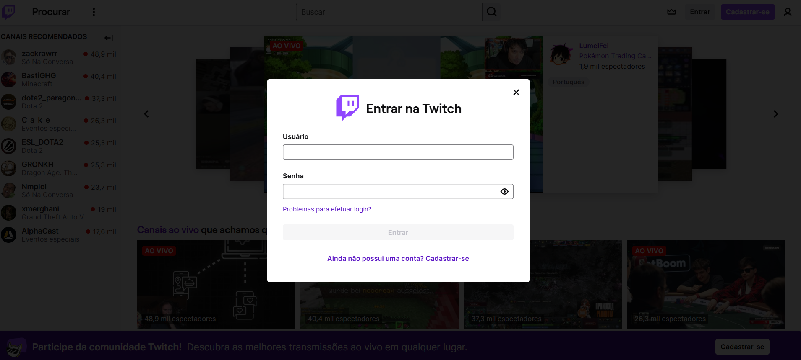
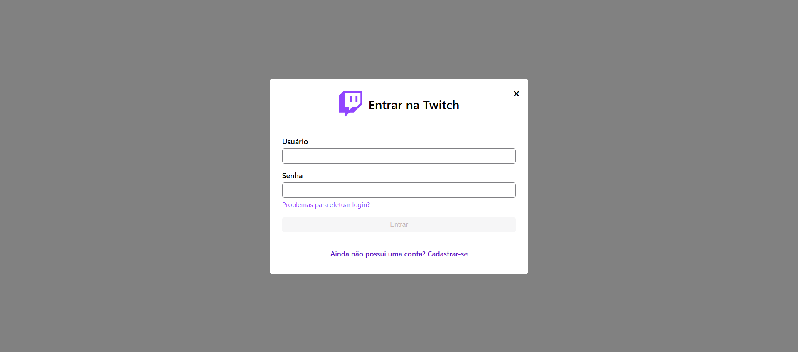
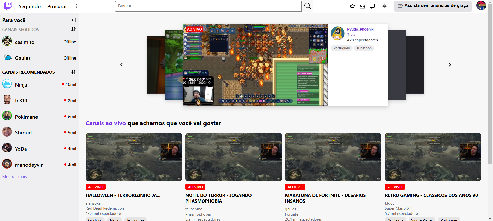
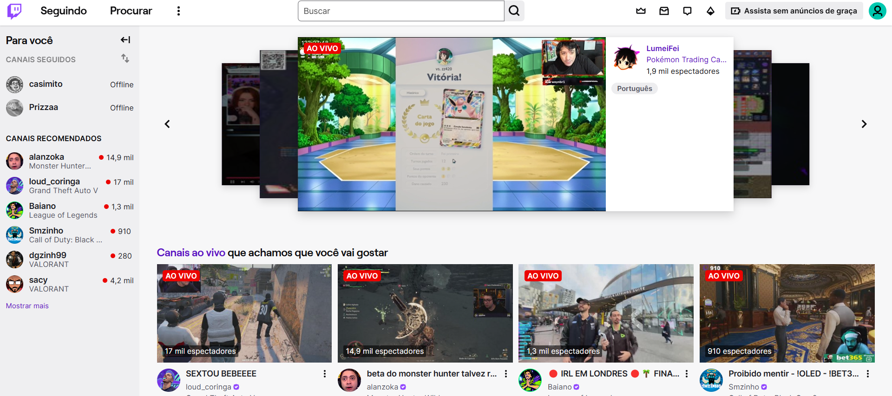

# Projeto Individual - Clone Twitch

## React + Vite

## Descrição

Este projeto é uma aplicação em React.js desenvolvida durante a residência Serratec 2024.02, com o objetivo de clonar as páginas de login e home de um site existente. O site escolhido para a clonagem foi o Twitch. O foco principal foi replicar a interface, proporcionando ao usuário uma experiência visual semelhante à original.

## Capturas de Tela

### Tela de Login Original

### Tela de Login Clonada

### Tela Home Original

### Tela Home Clonada

